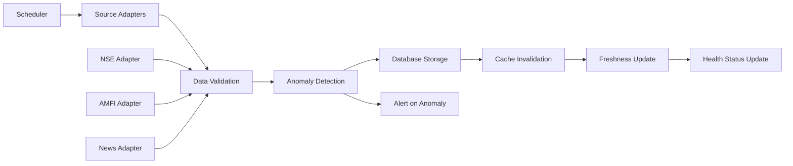
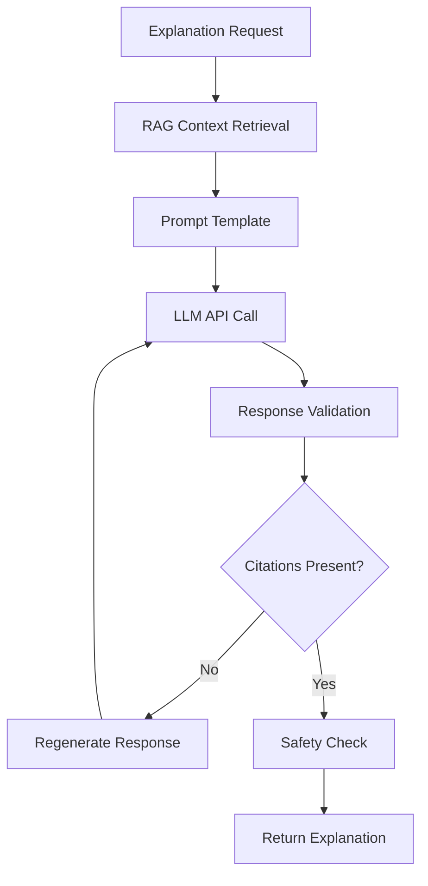

# Architecture Overview - Chimera MVP

## System Architecture

### High-Level Architecture
```
┌─────────────────┐    ┌─────────────────┐    ┌─────────────────┐
│   Android App   │    │  Backend API    │    │   Data Sources  │
│                 │    │                 │    │                 │
│  ┌───────────┐  │    │  ┌───────────┐  │    │  ┌───────────┐  │
│  │ Compose   │  │◄──►│  │ Spring    │  │◄──►│  │ NSE/BSE   │  │
│  │ UI        │  │    │  │ Boot      │  │    │  │ Bhavcopy  │  │
│  └───────────┘  │    │  └───────────┘  │    │  └───────────┘  │
│                 │    │                 │    │                 │
│  ┌───────────┐  │    │  ┌───────────┐  │    │  ┌───────────┐  │
│  │ Room      │  │    │  │PostgreSQL │  │    │  │ AMFI NAV  │  │
│  │ Cache     │  │    │  │+TimescaleDB│  │    │  │           │  │
│  └───────────┘  │    │  └───────────┘  │    │  └───────────┘  │
│                 │    │                 │    │                 │
│                 │    │  ┌───────────┐  │    │  ┌───────────┐  │
│                 │    │  │ Redis     │  │    │  │ News APIs │  │
│                 │    │  │ Cache     │  │    │  │ (RSS/GDELT)│  │
│                 │    │  └───────────┘  │    │  └───────────┘  │
└─────────────────┘    └─────────────────┘    └─────────────────┘
        ▲                       ▲                       ▲
        │                       │                       │
        ▼                       ▼                       ▼
┌─────────────────┐    ┌─────────────────┐    ┌─────────────────┐
│ User Interface  │    │  Business Logic │    │ Data Pipeline   │
│                 │    │                 │    │                 │
│ • Input Screen  │    │ • Ranking Algo  │    │ • Ingestion     │
│ • Results View  │    │ • Feature Eng   │    │ • Quality Check │
│ • Chat/Explain  │    │ • LLM Service   │    │ • Freshness     │
│ • Offline Cache │    │ • Calibration   │    │ • Anomaly Det.  │
└─────────────────┘    └─────────────────┘    └─────────────────┘
```

## Component Architecture

### Android Application (3-Screen UX)
```
app/
├── ui/
│   ├── input/           # Screen 1: Investment parameters
│   ├── results/         # Screen 2: Ranked recommendations  
│   ├── chat/            # Screen 3: Explanations & Q&A
│   └── common/          # Shared UI components
├── data/
│   ├── api/             # Backend API client
│   ├── cache/           # Room database for offline
│   └── repository/      # Data layer abstraction
├── domain/
│   ├── model/           # Business entities
│   └── usecase/         # Business logic
└── di/                  # Dependency injection setup
```

### Backend Services Architecture
```
backend/
├── controller/          # REST API endpoints
│   ├── RankingController    # POST /rank, POST /rank/explain
│   ├── ChatController       # POST /chat/ask
│   └── HealthController     # GET /health/*, GET /freshness
├── service/             # Business logic layer
│   ├── RankingService       # Asset scoring and ranking
│   ├── FeatureService       # Technical indicator calculation
│   ├── LLMService          # AI explanation generation
│   ├── DataIngestionService # ETL pipeline orchestration
│   └── FreshnessService     # Data quality monitoring
├── data/                # Data access layer
│   ├── repository/          # JPA repositories
│   ├── entity/             # Database entities
│   └── migration/          # Flyway SQL scripts
└── config/              # Configuration and security
    ├── SecurityConfig       # Rate limiting, CORS
    ├── CacheConfig         # Redis configuration
    └── FeatureFlagConfig   # Feature toggles
```

## Data Architecture

### Database Schema Design
```sql
-- Time-series tables (TimescaleDB)
CREATE TABLE market_data (
    symbol VARCHAR(20),
    date DATE,
    open DECIMAL(12,2),
    high DECIMAL(12,2),
    low DECIMAL(12,2),
    close DECIMAL(12,2),
    volume BIGINT,
    source VARCHAR(10),  -- 'NSE', 'BSE'
    PRIMARY KEY (symbol, date, source)
);
SELECT create_hypertable('market_data', 'date');

-- Mutual fund NAV data
CREATE TABLE fund_nav (
    scheme_code VARCHAR(20),
    date DATE,
    nav DECIMAL(12,4),
    PRIMARY KEY (scheme_code, date)
);
SELECT create_hypertable('fund_nav', 'date');

-- News and sentiment data
CREATE TABLE news_articles (
    id UUID PRIMARY KEY,
    title VARCHAR(500),
    summary TEXT,
    url VARCHAR(1000),
    published_at TIMESTAMP,
    source VARCHAR(50),
    sentiment_score DECIMAL(3,2), -- [-1, 1]
    symbols VARCHAR[], -- Related symbols
    embedding vector(768) -- pgvector for RAG
);

-- Feature vectors
CREATE TABLE asset_features (
    symbol VARCHAR(20),
    date DATE,
    returns_1d DECIMAL(8,4),
    returns_1w DECIMAL(8,4),
    returns_1m DECIMAL(8,4),
    volatility_ewma DECIMAL(8,4),
    momentum_12_1 DECIMAL(8,4),
    reversal_1w DECIMAL(8,4),
    volume_zscore DECIMAL(6,2),
    sentiment_avg DECIMAL(3,2),
    PRIMARY KEY (symbol, date)
);
SELECT create_hypertable('asset_features', 'date');

-- Ranking results (cached)
CREATE TABLE ranking_cache (
    cache_key VARCHAR(100) PRIMARY KEY,
    results JSONB,
    confidence DECIMAL(3,2),
    created_at TIMESTAMP DEFAULT NOW(),
    expires_at TIMESTAMP
);

-- Data quality and freshness tracking
CREATE TABLE ingestion_log (
    id SERIAL PRIMARY KEY,
    source VARCHAR(50),
    date DATE,
    records_processed INTEGER,
    anomalies_detected INTEGER,
    processing_time_ms INTEGER,
    success BOOLEAN,
    created_at TIMESTAMP DEFAULT NOW()
);
```

### Caching Strategy
```yaml
Redis Cache Layers:
  L1 - API Response Cache:
    Pattern: "ranking:{hash(request)}"
    TTL: 5-15 minutes (based on data freshness)
    Content: Complete /rank API responses
    
  L2 - Feature Cache:
    Pattern: "features:{symbol}:{date}"
    TTL: 4 hours (updates after market close)
    Content: Computed technical indicators
    
  L3 - News Cache:
    Pattern: "news_sentiment:{date}"
    TTL: 30 minutes
    Content: Aggregated sentiment scores
    
  L4 - Rate Limiting:
    Pattern: "ratelimit:{ip}:{endpoint}"
    TTL: 60 seconds
    Content: Request counters
```

## Service Integration Patterns

### Data Ingestion Pipeline


### Ranking Request Flow
```mermaid
graph TD
    A[Mobile App] --> B[Rate Limiter]
    B --> C[Input Validation]
    C --> D[Cache Check]
    D --> E{Cache Hit?}
    E -->|Yes| F[Return Cached Result]
    E -->|No| G[Feature Loading]
    G --> H[Ranking Computation]
    H --> I[Confidence Calibration]
    I --> J{Above Threshold?}
    J -->|Yes| K[Return Results]
    J -->|No| L[Return "Uncertain"]
    K --> M[Update Cache]
    L --> M
```

### LLM Explanation Flow


## Security Architecture

### Authentication & Authorization
```yaml
API Security:
  Rate Limiting:
    Global: 1000 req/hour per IP
    Per User: 100 req/hour (if authenticated)
    Burst: 10 req/minute
    
  Input Validation:
    Amount: 1000 ≤ amount_inr ≤ 10,000,000
    Horizon: horizon_days ∈ [1, 90]
    Risk: risk_pref ∈ ['conservative', 'moderate', 'aggressive']
    
  CORS Policy:
    Allowed Origins: chimera-app domains only
    Allowed Methods: GET, POST
    Allowed Headers: Content-Type, Authorization
    Credentials: false
```

### Data Protection
```yaml
Encryption:
  At Rest: 
    Database: AES-256 (platform managed)
    Secrets: Fly.io Secrets (encrypted)
    
  In Transit:
    API: TLS 1.3 only
    Database: TLS encrypted connections
    Cache: TLS to Redis
    
Data Anonymization:
  User Queries: Strip PII, hash identifiers
  Logs: Redact sensitive patterns
  Analytics: Aggregate only, no individual tracking
```

## Scalability & Performance

### Performance Targets
```yaml
API Response Times:
  /rank endpoint: p95 < 2.5s, p50 < 1.0s
  /explain endpoint: p95 < 3.0s, p50 < 1.5s
  /freshness endpoint: p95 < 200ms, p50 < 100ms
  /health endpoints: p95 < 100ms, p50 < 50ms
  
Throughput Targets:
  Concurrent Users: 100 (MVP phase)
  Requests per Minute: 500 peak
  Database Connections: 20 max pool size
  
Data Processing:
  EOD Ingestion: Complete within 30 min of source publish
  Feature Computation: < 5 minutes for full universe
  News Processing: < 2 minutes from RSS fetch
```

### Scaling Strategy
```yaml
Horizontal Scaling (Future):
  App Instances: Auto-scale 1-5 instances based on CPU
  Database: Read replicas for feature queries
  Cache: Redis cluster for high availability
  
Vertical Scaling (MVP):
  CPU: 1 shared CPU → 2 dedicated CPUs
  Memory: 512MB → 2GB
  Storage: 10GB → 50GB
  
Optimization Priorities:
  1. Database query optimization (indexes, query plans)
  2. Feature computation vectorization
  3. API response caching strategy
  4. Mobile app offline-first architecture
```

## Deployment Architecture

### Environment Topology
```yaml
Development:
  Backend: Local Docker container
  Database: Docker Compose PostgreSQL
  Cache: Docker Compose Redis
  Mobile: Android Emulator/Device
  
Staging:
  Backend: Fly.io app (staging)
  Database: Fly.io Postgres (development tier)
  Cache: Fly.io Redis (shared)
  Mobile: Firebase App Distribution
  
Production:
  Backend: Fly.io app (production)
  Database: Fly.io Postgres (standard tier)
  Cache: Fly.io Redis (dedicated)
  Mobile: Google Play Store
```

### Infrastructure as Code
```yaml
Fly.io Configuration:
  app: chimera-backend
  primary_region: sin  # Singapore (closest to India)
  auto_stop_machines: false
  auto_start_machines: true
  
  http_service:
    internal_port: 8080
    force_https: true
    auto_stop_machines: false
    
  env:
    SPRING_PROFILES_ACTIVE: production
    SERVER_PORT: 8080
    MANAGEMENT_SERVER_PORT: 8081
```

## Monitoring & Observability

### Metrics Collection
```yaml
Business Metrics:
  - Ranking requests per hour
  - User satisfaction indicators
  - Data freshness by source
  - Confidence score distribution
  
Technical Metrics:
  - API latency percentiles
  - Database connection pool usage
  - Cache hit rates by layer
  - JVM memory and GC metrics
  
Data Quality Metrics:
  - Ingestion success rates
  - Anomaly detection alerts
  - Feature computation errors
  - LLM response validation failures
```

### Health Monitoring
```yaml
Application Health:
  - Service discovery readiness
  - Database connectivity
  - External API availability
  - Background job status
  
Data Health:
  - Source data age (freshness)
  - Record count validation
  - Quality score thresholds
  - Processing pipeline status
```

---

## Technology Decision Rationale

### Why Spring Boot 3.3.x?
- **Mature ecosystem**: Extensive library support for financial applications
- **Native compilation**: GraalVM support for faster startup times
- **Security**: Built-in security features and regular updates
- **Observability**: Excellent monitoring and metrics integration

### Why PostgreSQL + TimescaleDB?
- **Time-series optimization**: Efficient storage and queries for OHLC data
- **Vector search**: pgvector extension for RAG implementation
- **ACID compliance**: Critical for financial data integrity
- **Horizontal scaling**: Read replicas and partitioning capabilities

### Why Jetpack Compose?
- **Modern UI**: Declarative UI reduces complexity
- **Performance**: Efficient rendering and state management
- **Maintainability**: Less boilerplate code
- **Future-proof**: Google's strategic direction for Android UI

### Why Fly.io PaaS?
- **Geographic proximity**: Singapore region for low latency to India
- **Docker-native**: Easy deployment and scaling
- **Managed services**: Reduces operational overhead
- **Cost-effective**: Competitive pricing for MVP scale

---
*Last Updated: 2025-08-10*  
*Architecture Review: Before Phase M2*  
*Performance Validation: Phase M8*