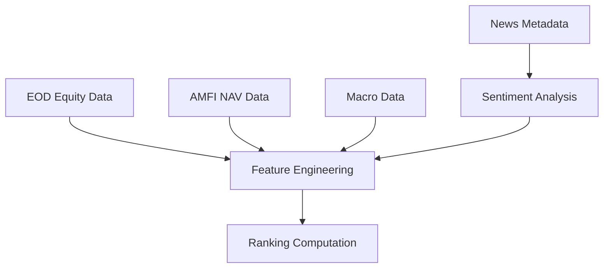

# Data Ingestion Jobs Specification

## Purpose
Define scheduling windows, retry policies, rate limits, and orchestration for all data ingestion jobs in Chimera MVP.

## Schedule Windows (IST)

### EOD Equity Data (NSE/BSE)
- **Primary Window**: 16:30 - 17:00 IST (post-market closure)
- **Secondary Window**: 17:00 - 18:00 IST (fallback window)
- **Weekend/Holiday**: Skip (market closed)
- **Frequency**: Daily (market days only)

### AMFI NAV Data
- **Primary Window**: 22:00 - 23:00 IST (after AMFI publishes)
- **Secondary Window**: 23:00 - 00:30 IST (fallback window)  
- **Weekend**: Saturday only (for Friday NAVs)
- **Frequency**: Daily

### News Metadata (GDELT + RSS)
- **Primary Window**: Every 30 minutes (continuous)
- **Peak Hours**: 06:00 - 22:00 IST (higher frequency)
- **Off-Peak**: 22:00 - 06:00 IST (lower frequency)
- **Frequency**: 30-120 minutes (adaptive based on volume)

### Macro Economic Data (RBI/MoSPI/FBIL)
- **RBI Data**: 12:00 IST (daily), 15:00 IST (weekly releases)
- **MoSPI CPI/WPI**: Monthly on release dates (typically 12th-15th)
- **FBIL Yields**: 17:30 IST (post-market close)
- **Frequency**: Variable based on publication schedule

## Retry Policies

### Exponential Backoff Configuration
```yaml
retry_policy:
  initial_delay: 30s
  max_delay: 300s
  multiplier: 2.0
  max_attempts: 5
  jitter: true
```

### Job-Specific Retry Behavior

#### EOD Equity Data
- **Max Retries**: 5 attempts
- **Retry Intervals**: 30s, 60s, 120s, 240s, 300s
- **Circuit Breaker**: After 3 consecutive failures, delay next attempt by 1 hour
- **Critical Window**: If all retries fail before 18:00 IST, alert immediately

#### AMFI NAV Data
- **Max Retries**: 3 attempts
- **Retry Intervals**: 60s, 180s, 300s
- **Grace Period**: 30 minutes past expected publication time
- **Fallback**: Use previous day NAV with stale data flag

#### News Metadata
- **Max Retries**: 3 attempts
- **Retry Intervals**: 15s, 45s, 120s
- **Non-Critical**: Failures logged but don't block other jobs
- **Degraded Mode**: Continue with cached/partial data

#### Macro Data
- **Max Retries**: 4 attempts
- **Retry Intervals**: 120s, 300s, 600s, 1200s
- **Extended Window**: Allow up to 4 hours past expected time
- **Manual Override**: Support for manual trigger if automated fails

## Rate Limiting

### Source-Specific Limits

#### NSE/BSE Data Sources
- **Request Rate**: Maximum 10 requests/minute per source
- **Concurrent Connections**: Maximum 2 simultaneous connections
- **Daily Quota**: 500 requests per day per source
- **Politeness Delay**: 2-5 seconds between requests
- **User-Agent**: Professional identification with contact info

#### AMFI Official Portal
- **Request Rate**: Maximum 5 requests/minute
- **Concurrent Connections**: 1 connection only
- **Daily Quota**: 200 requests per day
- **Respectful Access**: Cache responses, minimize redundant requests

#### News Sources (GDELT/RSS)
- **GDELT API**: 100 requests/hour (free tier)
- **Reuters RSS**: 50 requests/hour
- **PIB RSS**: 20 requests/hour
- **Combined News**: Stagger requests across sources

#### RBI/Government Sources
- **Request Rate**: Maximum 5 requests/minute
- **Concurrent Connections**: 1 connection
- **Bulk Downloads**: Prefer bulk files over individual records
- **Caching**: Aggressive caching to minimize requests

### Rate Limit Enforcement
```java
@RateLimiter(name = "nse-api", fallbackMethod = "fallbackToCache")
@CircuitBreaker(name = "nse-circuit", fallbackMethod = "fallbackToStale")
public CompletableFuture<IngestionResult> ingestNseData();
```

## Job Orchestration

### Dependency Graph


### Orchestration Rules
1. **EOD Priority**: Equity and NAV data must complete before ranking jobs
2. **News Independence**: News ingestion runs independently, doesn't block critical path
3. **Macro Timing**: Macro data ingested when available, not blocking other jobs
4. **Feature Pipeline**: Triggered only after core data (EOD + NAV) available

### Job Status Tracking
```sql
CREATE TABLE ingestion_jobs (
    job_id UUID PRIMARY KEY,
    job_type VARCHAR(50) NOT NULL,
    scheduled_at TIMESTAMP WITH TIME ZONE NOT NULL,
    started_at TIMESTAMP WITH TIME ZONE,
    completed_at TIMESTAMP WITH TIME ZONE,
    status VARCHAR(20) NOT NULL, -- SCHEDULED, RUNNING, COMPLETED, FAILED, RETRYING
    retry_count INTEGER DEFAULT 0,
    error_message TEXT,
    rows_processed INTEGER,
    data_quality_score DECIMAL(3,2),
    next_retry_at TIMESTAMP WITH TIME ZONE
);
```

## Monitoring and Alerting

### Success Metrics
- **EOD Completion**: Must complete within 2 hours of market close
- **NAV Availability**: Must complete within 2 hours of expected publication  
- **News Freshness**: Latest news within last 2 hours during market hours
- **Data Quality**: Quality score ≥ 0.85 for all critical data sources

### Alert Conditions

#### Critical Alerts (Immediate Action)
- EOD data ingestion failure after all retries
- AMFI NAV data not available by 01:00 IST
- Database connection failures
- Data quality score < 0.70

#### Warning Alerts (Next Business Day)
- News ingestion delays > 4 hours
- Macro data delays > 24 hours
- Rate limit approaching (>80% of quota)
- Anomaly detection triggers (z-score > 4)

### Dashboard Metrics
- **Ingestion Latency**: Time from data availability to ingestion completion
- **Success Rate**: Percentage of successful ingestions by source
- **Data Freshness**: Age of most recent data by source
- **Quality Trends**: Data quality scores over time
- **Error Patterns**: Common failure modes and frequencies

## Configuration Management

### Environment-Specific Settings
```yaml
# Development
ingestion:
  schedule:
    eod_enabled: true
    eod_mock_data: true
    news_frequency: 60  # minutes
    
# Production  
ingestion:
  schedule:
    eod_enabled: true
    eod_mock_data: false
    news_frequency: 30  # minutes
    rate_limits:
      nse_rpm: 10
      amfi_rpm: 5
```

### Feature Flags
- `ENABLE_NSE_INGESTION`: Enable/disable NSE data ingestion
- `ENABLE_BSE_INGESTION`: Enable/disable BSE data ingestion  
- `ENABLE_NEWS_INGESTION`: Enable/disable news metadata ingestion
- `ENABLE_MACRO_INGESTION`: Enable/disable macro data ingestion
- `USE_MOCK_DATA`: Use mock data instead of live sources (dev/test)

## Failure Handling

### Graceful Degradation
1. **Stale Data Usage**: Continue operations with previous day's data
2. **Partial Ingestion**: Process available data sources, flag missing ones
3. **Manual Override**: Support for manual data upload in emergencies
4. **Cache Fallback**: Use cached responses when sources unavailable

### Recovery Procedures
1. **Automatic Recovery**: Jobs resume automatically after transient failures
2. **Manual Intervention**: Clear escalation procedures for persistent failures
3. **Data Backfill**: Procedures for historical data gaps
4. **Health Check Integration**: Jobs report status to health endpoints

## Compliance and Security

### Data Source Compliance
- **TOS Adherence**: All rate limits and usage terms strictly followed
- **Attribution**: Proper source attribution in all derived data
- **Caching Policies**: Respect source-specified cache durations
- **Access Logging**: All data access logged for audit purposes

### Security Measures
- **API Keys**: Stored in secure environment variables
- **TLS Encryption**: All data transfers over HTTPS/TLS 1.3
- **Input Sanitization**: All ingested data sanitized before storage
- **Access Control**: Ingestion endpoints secured with API authentication

---

**Document Version**: 1.0  
**Last Updated**: 2025-08-10  
**Next Review**: Before Phase M3 implementation  
**Owner**: Data Engineering Team